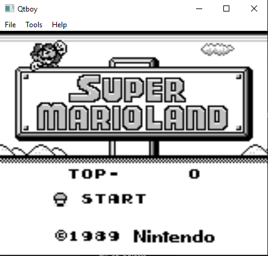
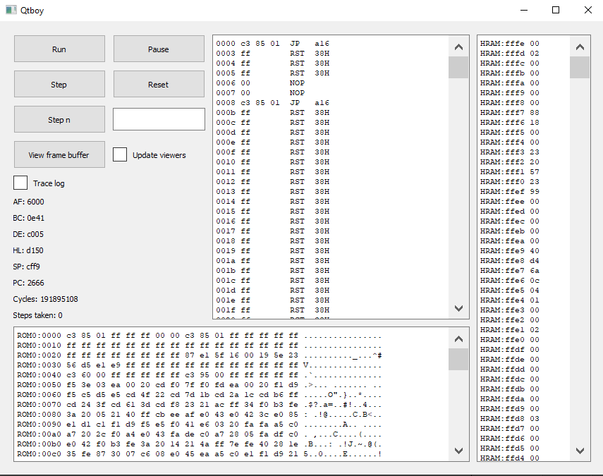
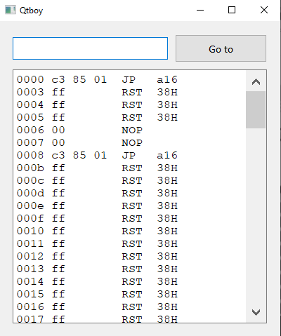
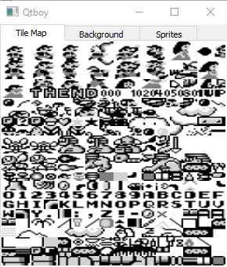
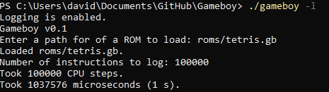

# QtBoy

A Game Boy (DMG) emulator written in C++ using [Qt 5.13](https://qt.io) for the GUI. WIP.

## Build

Use `make` to build a CLI version of the emulator on Windows or Linux.

[Install Qt](https://doc.qt.io/qt-5/gettingstarted.html) and load the project file located under platforms/qt/gameboy/gameboy.pro with Qt Creator to build a GUI version of the emulator.

## Progress

blaarg's CPU tests can be found [here](https://github.com/retrio/gb-test-roms)

Test|Status
---|---
cpu_instrs|:heavy_check_mark:
dmg_sound|:x:
instr_timing|:x:
mem_timing|:x:
oam_bug|:x:

## Screenshots

### GUI

### CLI

