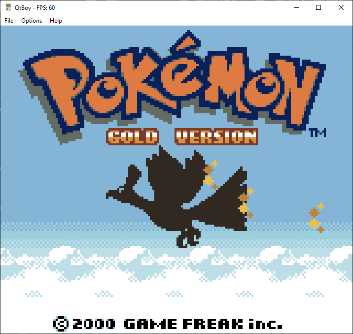
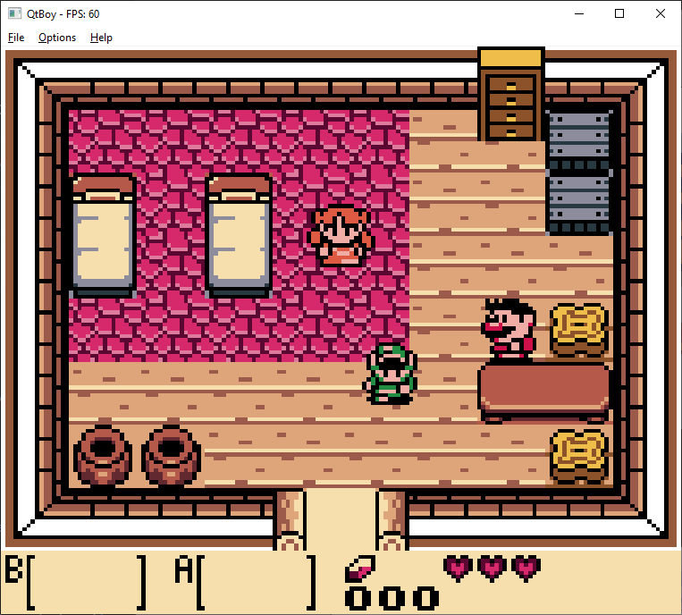
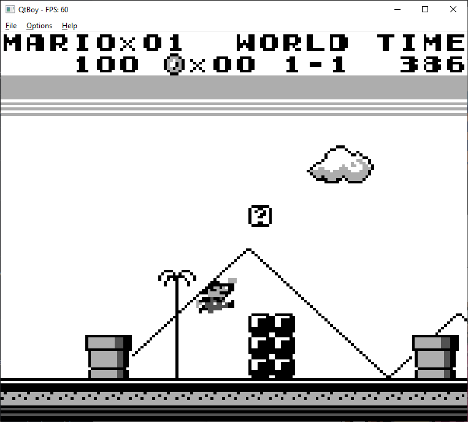
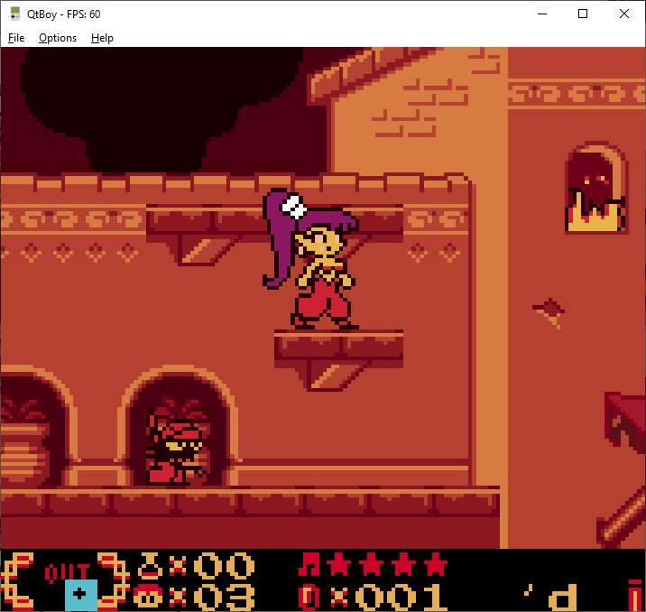

# QtBoy

A Game Boy and Game Boy Color emulator written in C++ using [Qt 5.13](https://qt.io). Get the latest release [here](https://github.com/davidtranhq/Qtboy/releases).

## Build

[Install Qt](https://doc.qt.io/qt-5/gettingstarted.html) and load the project file located under platforms/qt/gameboy/gameboy.pro with Qt Creator.

## Controls

Key|Control
---|---
Arrow Up|:arrow_up:
Arrow Down|:arrow_down:
Arrow Left|:arrow_left:
Arrow Right|:arrow_right:
D|:a:
S|:b:
Enter|Start
Shift|Select
Space|Turbo

## Screenshots

